# API Pizzería

Aplicación móvil desarrollada para gestionar pizzas e ingredientes mediante operaciones CRUD consumiendo una API REST.

---

# Modelo relacional de pizzas e ingredientes

El sistema utiliza una relación entre pizzas e ingredientes mediante una tabla intermedia llamada `pizza_ingredients`.

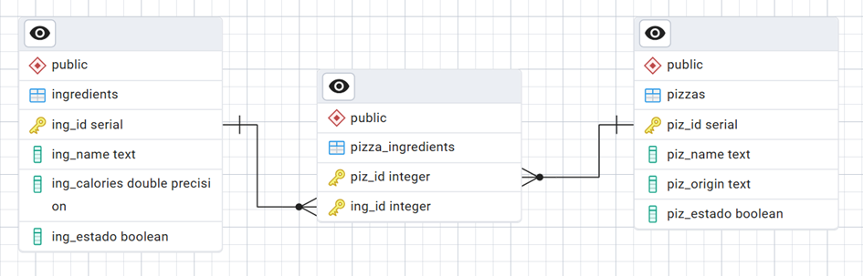

---

# Documentación de la API REST

La API REST permite realizar operaciones CRUD sobre pizzas e ingredientes.

Link de Swagger:

https://api-pizzeria-2ed4.onrender.com/swagger/index.html

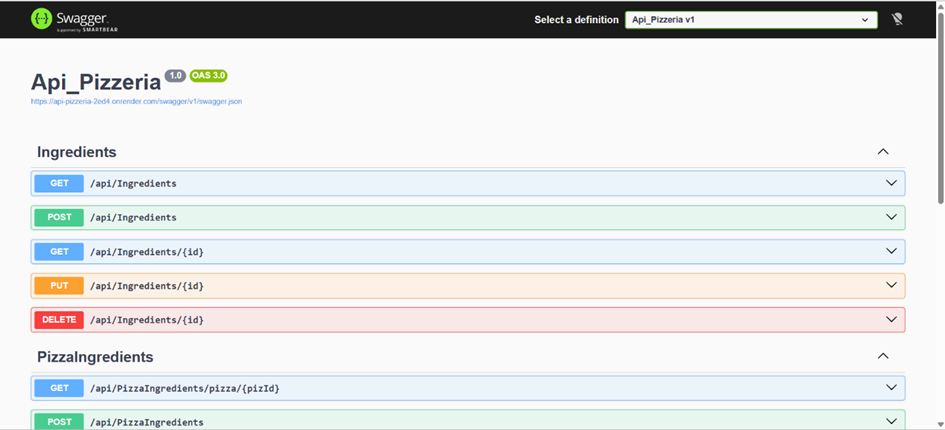

---

# Pantallas principales de la aplicación

## Menú principal

Pantalla principal desde donde se accede a la gestión de pizzas e ingredientes.

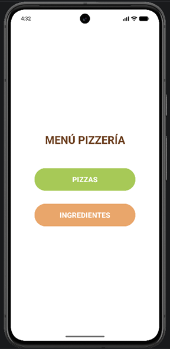

---

# CRUD de ingredientes

Pantalla principal para administrar ingredientes.

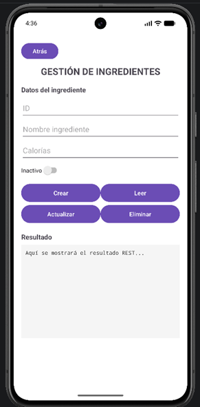

## Crear ingrediente

Permite registrar nuevos ingredientes en el sistema.

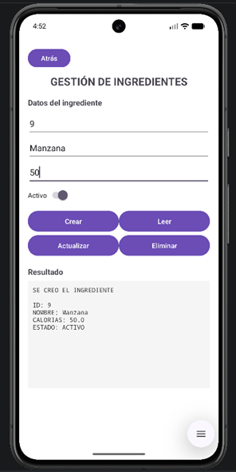

## Actualizar ingrediente

Permite modificar la información de un ingrediente existente.

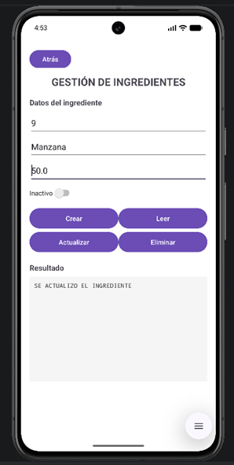

## Eliminar ingrediente

Permite eliminar ingredientes registrados.

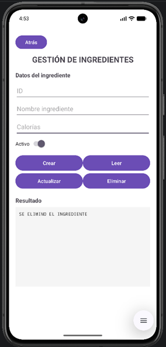

---

# CRUD de pizzas

Pantalla principal para administrar pizzas.

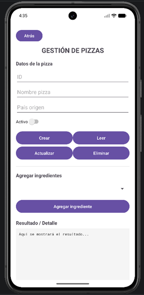

## Crear pizza

Permite registrar nuevas pizzas junto con sus ingredientes.

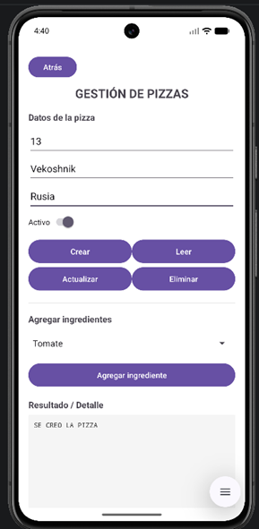

## Actualizar pizza

Permite modificar los datos de una pizza registrada.

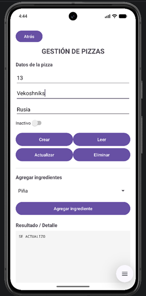

## Eliminar pizza

Permite eliminar pizzas existentes.

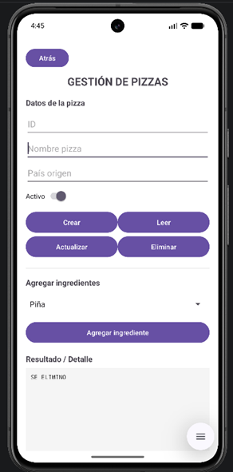

## Leer pizza

Permite consultar la información completa de una pizza y sus ingredientes asociados.

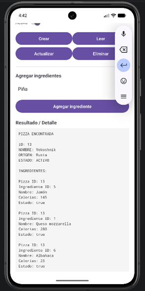

---
